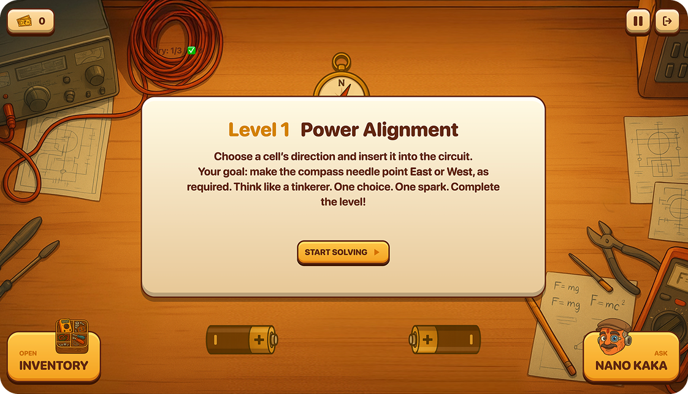

# 🎮 PlayPower: Fix-It

A physics-based educational simulation game — built during the **Playpower EdSprint Hackathon** as part of **The Vibe Coding and Design Challenge**.

> **By** [Meet Suthar](https://www.linkedin.com/in/meet-suthar-03126a257/) (Frontend, UI/UX, Game Assets) **&** [Bhavya Prajapati](https://www.linkedin.com/in/bhavya-prajapati1) (Backend, Full Stack Dev)

---

## 🚀 Game Link

🔗 [Play the Game](https://play-power-fork.vercel.app/)  
🎨 [Figma Design Workspace](https://www.figma.com/design/OhcToOSPda5e7dTJmqb9R4/Play-Power-Labs?node-id=0-1)  
💻 [GitHub Repository](https://github.com/meetsuthar27/play-power)

---

## 🧠 About the Game

**PlayPower: Fix-It** is a quirky, learning-based simulation game where players run a small-town repair shop — solving real-world gadget issues using physics!

Each customer’s problem is rooted in physics concepts like **electricity, optics, sound, and magnetism** — and solving them is fun, interactive, and educational.

### 🌟 Key Features

- Interactive repair puzzles based on real physics concepts
- Engaging storytelling with lovable Indian characters
- Custom-designed vector graphics with cultural charm
- Voice of Nano Kaka – your witty AI science guide
- Each level ends with a conceptual science explanation

---

## 🧩 Gameplay Loop

1. **Customer Interaction**: Hear quirky problems through personalized dialogues
2. **Workbench Puzzle**: Use sliders, switches, and components to solve it
3. **Feedback & Rewards**: Earn in-game currency + real science explanation from Nano Kaka
4. **Progress**: Move to the next level with fresh problems and concepts

---

## 📜 Game Lore

Welcome to **PlayPower Town**, a vibrant Indian neighborhood full of eccentric gadgets and even more eccentric people. You’re **Monty**, the town’s go-to gadget fixer, solving everyday tech mysteries using science — and some jugaad.

You're guided by **Nano Kaka**, a retired science teacher turned hilarious AI assistant.

---

## 🧠 Levels Overview

| Level | Title                       | Physics Concept                          |
| ----- | --------------------------- | ---------------------------------------- |
| 1     | Magnetic Circuits & Compass | Electromagnetism, Magnetic Fields        |
| 2     | Optics & Image Formation    | Lens behavior, Real vs Virtual Images    |
| 3     | Resistor Code Builder       | Resistor color codes, Practical circuits |
| 4     | Laser & Mirror Puzzle       | Reflection, Spatial Reasoning            |
| 5     | Physics Recap Quiz          | Knowledge checkpoint                     |

---

## 🌍 Art & Visual Direction

- **Vector + Indian Anime Style** illustrations
- Warm, vibrant color palette
- Cluttered, overstuffed repair shop for realism
- Indian-style signboards, hand-painted walls, and characters in desi attire

---

## 👨‍🔧 Characters

- **Monty** – The fixer, physics nerd, and the player
- **Nano Kaka** – AI-powered science guru, full of wisdom and witty hints
- **Customers** – Relatable Indian personalities with fun dialogues:
  - Uncle Didi
  - Chacha
  - Chotu
  - Teacher

---

## 🎯 Core Philosophy

> **“Fun First, Learning Naturally.”**  
> Our goal was to make kids curious about physics — not by forcing concepts, but by letting them discover through trial, gameplay, and character-driven storytelling.

---

## 🛠 Tech Stack

### Frontend

- React + TailwindCSS
- Motion Cursor for interactivity
- Vercel for deployment

### Design & Assets

- Figma
- Adobe Photoshop
- Audacity
- Pixabay
- AI-assisted ideation (ChatGPT, Google Gemini)

### Backend & Dev

- Node.js (v0.dev)
- GitHub
- Gemini Canvas
- VS Code

---

## 🌱 Future Scope

- 🎙️ Voiced character dialogues for deeper immersion
- ✨ More levels across physics, chemistry, math, and biology
- 🎓 Plug-in support for EdTech/school platforms
- 📈 Learning analytics & adaptive difficulty
- 👥 Expanded character universe and side quests

---

## 👥 Team

### 🧑‍🎨 Meet Suthar

Frontend Developer & UI/UX Designer  
[GitHub](https://github.com/meetsuthar27) • [LinkedIn](https://www.linkedin.com/in/meet-suthar-03126a257/) • [Behance](https://www.behance.net/meeeetsuthar)  
**Roles:** Ideation, Visual Design, Assets, Frontend

### 🧑‍💻 Bhavya Prajapati

Full Stack Developer  
[GitHub](https://github.com/bhavyagp) • [LinkedIn](https://www.linkedin.com/in/bhavya-prajapati1)  
**Roles:** Ideation, Backend, Optimization, Full-Stack Dev

---

## 🙏 Acknowledgements

Special thanks to the **Playpower EdSprint Hackathon** organizers and mentors, as well as the community for providing valuable feedback and motivation.

---

## 📸 Screenshots

- Main Screen
  

- Customer Dialogue

  
  

- Tinker Table (Repair Mode)

  
  

---

## 💬 Feedback?

We’d love to hear your thoughts!  
Feel free to [drop us a message](https://www.linkedin.com/in/meet-suthar-03126a257/).

---
